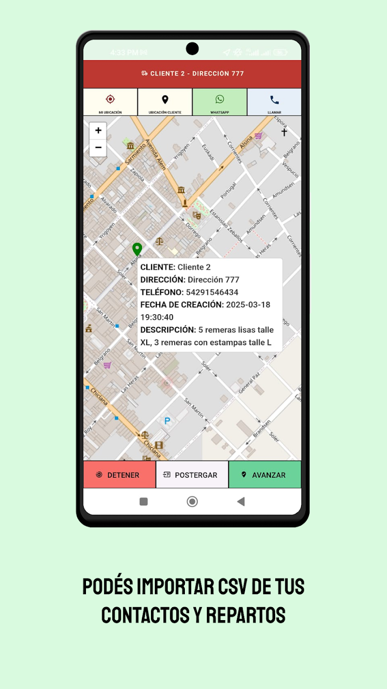
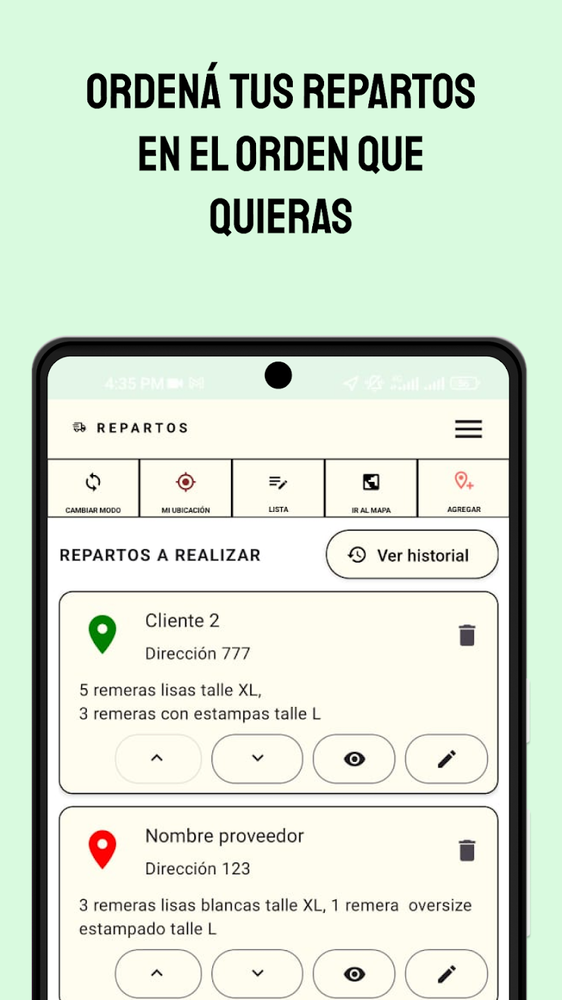

# RUTAPP - app para gestionar repartos 

Esta app sirve para gestionar repartos en un mapa interactivo.
Si te interesa implementar tener esta app en tu empresa no dudes en hablarme a mi email y te cotizo acorde a tus necesidades: brianmunozjob@gmail.com 

 [En su momento se subio al play store (+100 descargas)](https://play.google.com/store/apps/details?id=com.appsbucket.rutapp&pli=1) 


 


## Screenshots





## Video demostración

[Ver demo](documentacion/video/demo.mp4)


## Requerimientos

- React: 18.2.0
- React Native: 0.74.1
- Expo: 51
-  [Expo go sdk 51](https://expo.dev/go) 


## Instalación
Clona el proyecto
```bash
git clone https://github.com/brianmunioz/rutapp-app-logistica-expo.git
```

Acceder al directorio
```bash
cd rutapp-app-logistica-expo
```


Instalá todas las dependencias con yarn

```bash
yarn
```


Con el siguiente comando corres la app:


```bash
yarn start
```

## Licencia

Este proyecto es **propietario**.  
Uso comercial requiere obtener licencia pagando.  
Contacto: brianmunozjob@gmail.com
